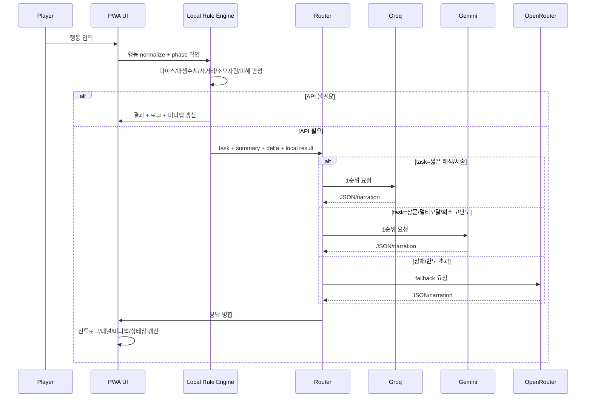

# 여러 AI API를 병행 사용하고 플레이어별 API 키를 허용하는 ManRPG PWA 아키텍처

## Executive summary

가장 현실적인 구조는 **규칙·판정·전투·보상·미니맵은 전부 로컬 JS에서 처리하고**, AI API는 **GM 묘사**, **행동 해석의 애매한 부분**, **희소한 스킬/마법 설명 생성**에만 쓰는 방식입니다. 이 방식이 토큰을 가장 크게 절약합니다. 이유는 ManRPG 통합본이 이미 **일반 판정=1d[유효스탯]**, **절대판정=1d100 ≤ 유효스탯+보정**, **최대 HP/MP/MP 회복/평타 피해 공식**, **각 층 적 1명**, **반응은 턴 미소모**, **민첩이 상대의 2배 이상이면 기본 공격 추가타 가능** 같은 결정 규칙을 명시하고 있기 때문입니다. 즉 “재미를 위한 서술”만 API에 맡기고, “정답이 있는 규칙 처리”는 로컬에서 끝내는 것이 가장 싸고 안정적입니다. fileciteturn0file0

현재 기준으로는 **짧은 텍스트·구조화 JSON·저비용**에는 **Groq Llama 3.1 8B**, **저비용 벤더-중립 fallback**에는 **OpenRouter GPT-OSS-20B**, **긴 컨텍스트·멀티모달·어려운 요청**에는 **Gemini 3.1 Flash Lite**를 우선순위로 두는 구성이 가장 균형이 좋습니다. Groq는 공식 모델 문서에 초당 토큰 속도와 가격이 명확하고, Gemini는 공식적으로 캐싱 계층과 장문 컨텍스트 최적화가 잘 드러나며, OpenRouter는 매우 저렴한 모델과 free router를 제공해 페일오버에 유리합니다. citeturn8view0turn10view0turn20view2turn21view0

보안 측면에서 핵심은 “**플레이어가 입력한 장기 API 키를 클라이언트에 두면서 완전히 숨기는 방법은 없다**”는 점입니다. Gemini의 **ephemeral token**도 공식적으로 **클라이언트 앱에서 추출될 수 있으며**, 현재는 **Live API 전용**입니다. 따라서 일반 텍스트 추론 API에서는 **직접 브라우저 호출 모드(가장 저렴하지만 키 노출 위험 큼)**, **Cloudflare Worker 중계 모드(CORS·공통 라우팅·정책 강제용)**, **운영자 관리 키 모드(가장 안전하지만 운영비 부담)**를 분리해야 합니다. 특히 **Groq는 rate limit가 조직 단위**, **Gemini는 프로젝트 단위**, **OpenRouter는 추가 API 키를 만들어도 글로벌 용량 관리 구조**라서, 같은 계정/프로젝트를 여럿이 공유하면 플레이어별 쿼터 분리가 되지 않습니다. citeturn38view0turn3view1turn13view0turn16view0

Cloudflare Worker 프록시는 공개 배포에서 가장 현실적인 최소 서버 옵션입니다. Workers Paid는 **월 $5부터**, **10M 요청/월 포함**, 초과 시 **$0.30/백만 요청**, Free는 **100,000 요청/일**, 메모리 **128MB**, Free/유료 각각 **50/10,000 subrequests per invocation**이므로 “LLM 1회 호출 = Worker 요청 1회 + 외부 fetch 1회” 구조를 만들면 비용 산정이 단순합니다. 단, Workers Logs를 켜면 Free는 **3일**, Paid는 **7일** 보존이 기본이므로 프롬프트·키·개인정보가 request body에 남지 않도록 설계해야 합니다. citeturn28view1turn27view1turn26view4turn26view6turn26view0turn26view7

## API 후보 우선순위와 비교

아래 표는 **“ManRPG PWA에서 실제로 쓰기 좋은 후보”**만 뽑아 정리한 것입니다. Gemini는 공식 공개 문서가 **interactive RPM/TPM/RPD 숫자를 전부 노출하지 않고 AI Studio 로그인 화면으로 연결**하기 때문에, 표에는 **공개 문서에서 확인 가능한 범위만** 넣었습니다. OpenRouter도 paid 모델은 공개 문서상 고정 RPM/TPM 수치 대신 **키별 조회 엔드포인트**를 안내합니다. citeturn13view0turn14view0turn16view0

| 우선 | 플랫폼 / 모델 | 무료 / 체험 | 유료 단가 | RPM / TPM / RPD / 기타 한도 | 응답 지연 / 장점 / 단점 | 근거 |
|---|---|---:|---:|---|---|---|
| 1 | **Groq / llama-3.1-8b-instant** | Free plan 존재 | **$0.05 입력 / $0.08 출력** (1M tokens) | Free: **30 RPM / 6K TPM / 14.4K RPD / 500K TPD**. Developer base: **1K RPM / 250K TPM** | 공식 속도 **560 t/s**. 매우 빠르고 싸며 짧은 GM 묘사, 행동 해석 JSON에 적합. 다만 멀티모달/초장문 용도보다 텍스트 경량 업무에 더 맞음. | citeturn39view0turn8view0 |
| 2 | **OpenRouter / openai/gpt-oss-20b** | 별도 free variant 있음 | **$0.03 입력 / $0.14 출력** (모델 metadata를 1M 토큰 기준으로 환산) | Paid static 한도는 공개 고정표 없음. **`GET /api/v1/key`**로 키별 한도/잔여 크레딧 조회. | 벤더 중립 fallback에 좋고 direct Groq보다 저렴한 편. 다만 지연은 upstream/provider 상태에 따라 **가변**. | citeturn20view2turn16view0 |
| 3 | **Gemini / gemini-3.1-flash-lite** | Standard free tier에서 **Free of charge** | Standard: **$0.25 / $1.50**, Batch/Flex: **$0.125 / $0.75** | 공식 문서는 rate-limit 차원을 **RPM/TPM/RPD**로 정의하고, **프로젝트 단위** 적용이라 밝힘. 공개 문서상 exact interactive 수치는 AI Studio에서 확인. Batch enqueued tokens: Tier1 **10M**, Tier2 **500M**, Tier3 **1B** | 고볼륨용·장문 컨텍스트·멀티모달에 강함. Gemini 캐싱과 결합 시 강력. 단, 공개 문서만으로 exact interactive limit를 표준화하기 어려움. | citeturn10view0turn13view0 |
| 4 | **Groq / openai/gpt-oss-20b** | Free plan 존재 | **$0.075 입력 / $0.30 출력** | Free: **30 RPM / 8K TPM / 1K RPD / 200K TPD**. Developer base: **1K RPM / 250K TPM** | 공식 속도 **1000 t/s**. 구조화 출력·추론 품질이 8B보다 낫고, Groq Prompt Caching 지원 모델이라 반복 prefix 비용 절감에 유리. 출력 단가는 8B보다 높음. | citeturn39view0turn8view0turn35view0 |
| 5 | **Gemini / gemini-2.5-flash-lite** | Standard free tier에서 **Free of charge** | Standard: **$0.10 / $0.40** | exact interactive 수치는 public docs에서 미노출. 공식 공개 문서상 batch enqueued tokens는 Flash-Lite 계열이 Tier1 **10M**, Tier2 **500M**, Tier3 **1B** | 매우 저렴하고 at-scale에 적합. 다만 최신 계열 기준 기능/품질/지원 우선순위는 3.1 Flash Lite 쪽이 더 자연스러움. | citeturn10view3turn15view0 |
| 6 | **OpenRouter / openrouter/free** 또는 **gpt-oss-20b:free** | **$0 / $0** | 없음 | free model variant 공통: **20 RPM**, 하루 한도는 **10 credits 미만 결제 계정=50 RPD**, **10 credits 이상 구매 계정=1000 RPD** | “0원 emergency fallback”으로 유용. 하지만 품질·지연·선택 모델이 랜덤/가변이며, 운영 안정성용 주력으로 쓰기엔 약함. | citeturn21view0turn20view2turn16view0 |

실전 권장 순서는 다음처럼 잡는 것이 좋습니다. **행동 해석/짧은 GM 서술**은 Groq 8B를 먼저, **공통 fallback**은 OpenRouter GPT-OSS-20B, **장문 요약·멀티모달·희소한 고난도 요청**은 Gemini 3.1 Flash Lite로 넘기는 구성이 비용 대비 효율이 가장 좋습니다. 같은 이유로 “무조건 Gemini 하나만”보다는 **Groq + Gemini + OpenRouter** 3계층이 더 유리합니다. citeturn8view0turn10view0turn20view2turn21view0

## 비용 절감용 아키텍처와 멀티 API 라우팅

토큰을 줄이는 가장 큰 레버는 모델 선택보다 **“API를 아예 안 부르는 판정 분리”**입니다. ManRPG 통합본은 파생 수치와 전투 결과가 결정적으로 계산 가능한 규칙을 많이 제공하므로, **행동 가능 여부**, **소모 MP**, **피해량**, **보상 후보 수**, **마법서 성공/실패**, **상태 적용**, **미니맵 갱신**을 JS에서 끝내고, API에는 **“결과를 어떻게 재미있게 말해줄지”**만 묻는 편이 훨씬 효율적입니다. fileciteturn0file0

이 구조를 요청 단위로 쪼개면 다음과 같습니다.

| 요청 종류 | 로컬 선행 처리 | 입력 토큰 목표 | 출력 토큰 목표 | 기본 라우트 | fallback |
|---|---|---:|---:|---|---|
| 행동 해석 | 플레이어 행동을 규칙 키워드로 normalize, 가능/불가 판정은 로컬 | 120~220 | 60~120 | Groq 8B | OpenRouter GPT-OSS-20B |
| GM 묘사 | 이미 계산된 판정 결과만 서술용으로 전달 | 180~320 | 120~220 | Groq 8B | Gemini 3.1 Flash Lite |
| 장면 요약 | phase 전환, 층 전환, 저장 직전 summary 생성 | 250~500 | 120~200 | Gemini 3.1 Flash Lite | OpenRouter GPT-OSS-20B |
| 스킬/기술 생성 | 로컬 규칙 범위를 먼저 걸러 JSON schema 요청 | 250~600 | 150~300 | Gemini 3.1 Flash Lite | Groq GPT-OSS-20B |
| NPC 대사/연출 | 규칙 결과는 이미 확정, 대사만 생성 | 80~180 | 40~120 | Groq 8B | OpenRouter Free Router |

캐시는 반드시 넣는 것이 좋습니다. Groq는 **Prompt Caching**이 자동이며, 지원 모델에서는 **cached input 50% 할인**, **2시간 미사용 시 만료**, **cached tokens는 rate limit 카운트에서 제외**됩니다. 다만 현재 공식 문서상 지원 모델은 **GPT-OSS 계열 중심**이라 8B가 아니라 **Groq GPT-OSS-20B**를 “반복 prefix가 매우 많은 작업”에 선택하는 이유가 됩니다. citeturn35view0turn3view1

Gemini는 **2.5 이상 모델에서 implicit caching이 기본 활성화**되어 있고, explicit cache는 **TTL 기본 1시간**입니다. 공개 문서상 **Gemini 3.5 Flash와 2.5 Flash는 1024 tokens**, **Pro 쪽은 4096 tokens** 이상에서 context caching 임계가 표시됩니다. 따라서 Gemini 쪽은 **“세계관 요약 + 대형 공통 prefix + 최근 요약”**을 앞에 두고 **현재 턴 delta**를 뒤에 붙이는 구조가 잘 맞습니다. citeturn37view0

멀티 API 라우팅은 “비용 기준”과 “실패 시 downgrade”를 분리해야 합니다. 추천 로직은 이렇습니다. **1단계**: 로컬 엔진이 “API 필요 여부”를 결정. **2단계**: 필요 시 요청을 `interpret` / `narrate` / `summarize` / `generate-skill` 로 분류. **3단계**: task별 우선 모델 선택. **4단계**: timeout 또는 429/5xx면 같은 task의 fallback 체인으로 자동 이동. **5단계**: 무료 모델은 본문을 더 짧게 재압축한 뒤 한 번만 재시도. **6단계**: 그래도 실패하면 로컬 deterministic 결과만 UI에 표시하고 서술은 축약 문구로 대체. 이러면 “게임은 멈추지 않고, 연출만 덜 풍부해지는” 구조가 됩니다. citeturn16view0turn3view1turn13view0



이 시퀀스의 핵심은 **API가 “판정 엔진”이 아니라 “서술 엔진”에 가깝게 동작한다**는 점입니다. 그렇게 해야 같은 행동을 100번 해도 “규칙 결과는 동일하고, 말투와 서술만 달라지는” 안정적인 TRPG UX를 만들 수 있습니다. fileciteturn0file0

## 플레이어별 API 키 처리와 보안

플레이어별 API 키 처리는 **보안성**과 **운영비**가 정면으로 충돌합니다. 가장 싼 방식은 **브라우저 직결 BYOK**입니다. 플레이어가 자기 Groq/Gemini/OpenRouter 키를 넣고 브라우저가 곧바로 호출합니다. 이 방식은 서버 비용이 거의 0이고 배포도 쉬우나, 장기 키가 결국 클라이언트에 존재하므로 추출 위험이 있습니다. 또한 **Groq는 organization-level**, **Gemini는 project-level**, **OpenRouter는 API key를 여러 개 만들어도 글로벌 용량 관리**이므로, “같은 계정 안에서 키만 여러 개 나누는 것”으로는 플레이어별 한도 분리가 되지 않습니다. 플레이어별 분리를 원하면 **플레이어 각각의 별도 계정/프로젝트/키**가 필요합니다. citeturn3view1turn13view0turn16view0

Cloudflare Worker 프록시는 “키를 숨기는 마법”이라기보다 **CORS 통일**, **provider 공통 인터페이스**, **우선순위·fallback 강제**, **시스템 프롬프트 은닉**, **HTTP 헤더 정리**를 위한 수단으로 보는 것이 맞습니다. 운영자 키를 Cloudflare **Secrets**에 넣으면 secret value는 배포 후 Wrangler나 대시보드에서 그대로 다시 읽히지 않는 형태로 관리됩니다. 이 모드는 공개 배포에 가장 현실적입니다. 반대로 “플레이어 키를 Worker에 전달해서 매 요청 forward”하는 모드는 **직접 브라우저 호출보다 약간 나은 정책 통제**는 가능하지만, 플레이어가 자기 키를 입력하는 이상 그 키가 브라우저 측에 존재한다는 사실 자체는 변하지 않습니다. citeturn26view7turn28view1

Gemini의 **ephemeral token**은 중요한 예외입니다. 공식 문서상 이 토큰은 **짧게 살아가는 임시 인증 토큰**이며, **클라이언트 앱에서 추출될 수 있지만 만료가 짧아 보안 위험을 줄이는 용도**입니다. 다만 현재는 **Live API 전용**이며, 기본적으로 **새 세션 시작 1분**, **연결 후 30분** 정도의 수명을 갖습니다. 따라서 텍스트 생성 전반을 보호하는 범용 해법으로는 쓸 수 없고, **실시간 음성/WS 기능을 붙일 때만 특별 케이스로 사용**하는 편이 좋습니다. citeturn38view0

정리하면 권장 모드는 아래 셋입니다.

| 모드 | 키 위치 | 장점 | 단점 | 권장 용도 |
|---|---|---|---|---|
| **Direct BYOK** | 플레이어 브라우저 | 서버비 0, 구현 가장 쉬움 | 장기 키 노출 위험, provider별 CORS/정책 차이 | 개인/소규모 실험 |
| **Relay BYOK** | 플레이어 브라우저 + Worker 중계 | 공통 API 형식, fallback 강제, CORS 통일 | 키를 근본적으로 숨기진 못함, Worker 비용 추가 | 파티 테스트/베타 |
| **Managed Key Proxy** | Cloudflare Secrets | UX 최고, 키 보호 최고, 정책/로깅 제어 쉬움 | 운영자가 비용 부담, abuse 방어 필요 | 공개 배포 |

프록시를 켠다면 로그 정책은 매우 보수적으로 잡아야 합니다. Workers Logs는 Free에서 **3일**, Paid에서 **7일** 보존 기본이므로, **request body 전체 로깅 금지**, **prompt/response 전문 미저장**, **provider 응답 메타만 최소 저장**, **API 키는 해시만 남김**이 맞습니다. 키 입력 UX도 기본값은 **“임시 사용”**으로 두고, “이 기기에 저장”은 **명시적 opt-in**으로 분리하는 편이 좋습니다. citeturn26view0turn26view7

실패 UX 문구는 다음처럼 짧고 명확하게 두는 것이 좋습니다.

- `현재 모델 한도 초과입니다. 다음 우선순위 모델로 자동 전환합니다.`
- `AI 응답이 지연되어 로컬 규칙 결과만 먼저 표시합니다.`
- `프록시 연결에 실패했습니다. 같은 요청을 직결 모드로 다시 시도할 수 있습니다.`
- `사용자 API 키가 유효하지 않거나 권한이 없습니다. 키를 다시 입력해 주세요.`

## 프롬프트 템플릿, 로컬 처리 범위, 미니맵 설계

### 로컬 처리 범위

ManRPG 통합본을 기준으로 로컬 JS에 넣어야 하는 핵심은 다음입니다. **최대 HP = 체력×10**, **최대 MP = 레벨×5 + 지능×10**, **MP 회복 = 레벨 + 지혜×2**, **평타 피해 = floor((힘+체력)/10)+2**, **외공배수 = 1.4^외공**, **내공배수 = 1.2^내공**, **검기 단계별 atkMul/mpDelta**, **멀티캐스팅 = 기본값 × 시분할 trait 보정**, **외모에 따른 보상 후보 수/선택 수**, **마법 위력/MP 비용 식**, **마법서 등급별 서클 범위**, **마법서 습득 난이도**, **일반 판정과 절대판정**입니다. 이런 항목은 API로 넘기지 말고 JS 함수로 고정해야 합니다. fileciteturn0file0

| 함수 | 입력 | 출력 | 로컬 처리 이유 |
|---|---|---|---|
| `calcDerivedStats(state)` | 현재 스탯/레벨/외공/내공/검기/trait | `maxHP`, `maxMP`, `mpRegen`, `basicAtk`, `multi` | 규칙식이 결정적이므로 API 불필요 |
| `rollStatCheck(effStat, bonus)` | 유효스탯, 보정 | `{sides, roll, success}` | 일반 판정은 1d[유효스탯] |
| `rollAbsoluteCheck(effStat, bonus)` | 유효스탯, 보정 | `{roll100, target, success}` | 절대판정은 1d100 ≤ stat+bonus |
| `spellManaCost(circle, category)` | 서클, 범주 | MP 소모 | 통합본 규칙 기반 고정 |
| `spellPower(mpUsed, circle, category)` | 실제 사용 MP, 서클, 범주 | 피해/효과 위력 | 마법 위력은 사용 MP를 넘지 않음 |
| `canLearnMagicBook(wisdom, grade)` | 지혜, 마법서 등급 | 성공/실패 | 실패해도 책 유지 규칙 |
| `rewardConfig(appearance)` | 외모 | `offer`, `pick` | 보상 개수는 외모 기준 |
| `resolveAttackTurn(actor, target)` | 공격자, 대상 | 피해·상태·추가타 결과 | 민첩 2배 추가타, 반응 비소모 처리 |
| `updateMiniMap(state, events)` | 위치/시야/공격예고 | UI용 미니맵 데이터 | API 호출 없이 즉시 반영 가능 |

### 토큰 절감 프롬프트 포맷

가장 중요한 포맷은 **summary + delta**입니다. 전체 로그를 다시 보내지 말고, “현재 게임 요약”과 “이번 턴 변화분”만 보냅니다.

```text
[S]
floor=3 turn=12 phase=BATTLE
player={hp:88/120, mp:34/90, pos:[3,3], status:[]}
enemy={name:"식귀", hp:27/60, pos:[3,4], status:["화상1"]}
rules={oneEnemy:true, reactionFree:true}
summary="직전 턴에 플레이어가 뒤로 물러났고, 적은 전진했다."

[D]
action="왼쪽으로 한 칸 이동 후 화염구 사용"
local={
  move:true,
  inRange:true,
  mpCost:8,
  spellPower:6,
  absoluteCheck:null,
  outcome:"enemy_hp_after=21"
}

[O]
json only:
{
  "narration":"80자 이내",
  "combat_log":["짧은 로그 1~2개"],
  "ui_tags":["move","cast","burn"]
}
```

이 포맷은 Gemini의 context caching, Groq의 prefix caching, OpenRouter fallback 모두에 잘 맞습니다. 공통 prefix를 최대화하고 delta만 바뀌게 만들면 캐시 효율이 올라갑니다. citeturn35view0turn37view0

### 한국어 샘플 프롬프트

#### GM 묘사 최소 입력

```text
역할: ManRPG GM
목표: 규칙 판정은 이미 끝났다. 결과를 짧고 몰입감 있게 한국어로 묘사하라.
제약:
- 2~4문장
- 규칙 수치 재계산 금지
- 출력은 JSON
입력:
summary={{S}}
delta={{D}}
출력:
{
  "narration":"...",
  "tone":"grim|tense|calm",
  "next_hint":"다음 행동 힌트 1문장"
}
```

#### 스킬 생성 최소 입력

```text
역할: ManRPG 스킬 설계 보조
목표: 아래 제한 안에서 스킬 1개만 설계
제약:
- 반드시 JSON만 출력
- 새 규칙 추가 금지
- 설명은 60자 이내
입력:
class_theme="검과 화염"
allowed={
  mpDeltaRange:[-20,5],
  hpDeltaRange:[-10,10],
  atkMulRange:[0.8,2.0],
  judgeBonusRange:[-10,20]
}
output_schema={
  "name":"string",
  "mpDelta":"number",
  "hpDelta":"number",
  "atkMul":"number",
  "judgeStat":"힘|민첩|체력|지능|지혜|외모",
  "judgeBonus":"number",
  "desc":"string"
}
```

#### 행동 해석 최소 입력

```text
역할: ManRPG 행동 해석기
목표: 플레이어 자연어 행동을 규칙 키워드로 축약
제약:
- 서술 금지
- JSON만
입력:
action="기둥 뒤로 몸을 틀어 반박자 늦게 찌르기"
context={phase:"BATTLE", posPlayer:[3,3], posEnemy:[3,4]}
출력:
{
  "intent":"move_then_attack",
  "move":"left_back_step",
  "attack_type":"melee_attack",
  "needs_clarification":false,
  "clarify_question":""
}
```

### 미니맵 설계

7x7 전술맵과 별개로, 미니맵은 **“현재 상황을 빠르게 읽는 보조 UI”**여야 합니다. 즉 전체 타일을 다 보여주기보다 **방향·거리·위협** 위주가 더 낫습니다. 추천 포맷은 세 가지입니다.

#### 텍스트 포맷

```text
[미니맵]
북 ↑ : 빈 공간 2칸
동 → : 계단 3칸
남 ↓ : 적 없음
서 ← : 적 1칸, 근접 공격 예고
중앙 : 플레이어 C4
```

#### JSON 포맷

```json
{
  "self": {"cell":"C4","x":3,"y":3},
  "nearby": [
    {"dir":"E","kind":"stairs","dist":3},
    {"dir":"W","kind":"enemy","dist":1}
  ],
  "threats": [
    {"dir":"W","type":"melee","etaTurns":1}
  ],
  "interest": [
    {"dir":"N","kind":"open","dist":2}
  ]
}
```

#### 아이콘 포맷

```text
↖ ?   ↑ .   ↗ .
← ⚔1  ◎ P   → ⇣3
↙ .   ↓ .   ↘ .
```

여기서 `⚔1`은 “서쪽 1칸 적”, `⇣3`은 “동쪽 3칸 계단”, `?`는 미확인 오브젝트를 뜻하게 하면 됩니다. **공격 방향 표시**는 `↑ ↓ ← → ↖ ↗ ↙ ↘` 중 하나와 `etaTurns`를 함께 두는 방식이 가장 단순합니다. 실제 전술맵 7x7은 별도로 유지하고, 미니맵은 요약 정보만 반영하면 됩니다. 이 방식이 모바일에서 가장 읽기 쉽습니다.

## 비용/성능 시나리오와 우선 구현 단계

### 비용 가정

아래 시나리오는 **“로컬 규칙 엔진이 이미 판정을 끝낸 뒤”** API에 보내는 평균 요청을 기준으로 계산했습니다.

- 평균 **1회 API 호출 = 입력 250 tokens + 출력 180 tokens**
- 호출 종류는 행동 해석/GM 묘사/희소 생성 요청의 혼합 평균
- 추천 하이브리드 스택은 **Groq 8B 70% + OpenRouter GPT-OSS-20B 20% + Gemini 3.1 Flash Lite 10%**
- Proxy 비용은 별도 계산

이때 **1,000회 호출당** 모델 원가는 대략 다음 정도입니다.

| 스택 | 1,000회 호출당 입력 | 1,000회 호출당 출력 | 1,000회 호출당 비용 |
|---|---:|---:|---:|
| Groq Llama 3.1 8B | 250K | 180K | **$0.0269** |
| OpenRouter GPT-OSS-20B | 250K | 180K | **$0.0327** |
| Gemini 3.1 Flash Lite | 250K | 180K | **$0.3325** |
| **추천 하이브리드** | 250K | 180K | **$0.0586** |

위 계산은 각 공식 단가를 곱한 단순 산식입니다. Groq와 Gemini는 공식 가격표, OpenRouter는 공식 모델 metadata를 1M 토큰 기준으로 환산했습니다. citeturn8view0turn10view0turn20view2

### 일/주/월 시나리오

| 케이스 | 호출 수 | 토큰(입/출) | 추천 하이브리드 API 비용 | Cloudflare Worker 영향 |
|---|---:|---:|---:|---|
| **개인 플레이** | 100/일 · 700/주 · 3,000/월 | 25K/18K 일평균 | **$0.0059/일 · $0.041/주 · $0.176/월** | Free plan으로 충분한 수준 |
| **소규모 파티/테스트** | 5,000/일 · 35,000/주 · 150,000/월 | 1.25M/900K 일평균 | **$0.293/일 · $2.05/주 · $8.79/월** | Free 100K/day 이내면 여전히 가능, 공개 테스트면 Paid 고려 |
| **공개 배포** | 200,000/일 · 1.4M/주 · 6M/월 | 50M/36M 일평균 | **$11.72/일 · $82.07/주 · $351.72/월** | Workers Paid $5/월이면 요청 10M/월 포함 범위라 proxy 요청 자체는 아직 추가 과금 없음 |

Workers 쪽은 공개 배포에서 **6M requests/month**면 아직 **Paid 기본 10M included** 안에 들어가므로, 단순 relay라면 Worker 비용은 거의 **$5 기본요금** 수준으로 끝납니다. 다만 10M을 넘기면 **$0.30/백만 요청** 과금이 생기고, CPU도 30M CPU-ms 포함 이후 **$0.02/백만 CPU-ms**가 붙습니다. citeturn28view1turn27view1

### 구현 체크리스트

#### 단계 1
로컬 규칙 엔진을 먼저 완성합니다.

- [ ] `calcDerivedStats()` 구현
- [ ] 일반/절대 판정 함수 분리
- [ ] 공격/마법/상태/보상/상점/층 전환을 전부 로컬 처리
- [ ] API가 없어도 완주 가능한 루프 확보

#### 단계 2
BYOK UI를 붙입니다.

- [ ] provider 우선순위 선택
- [ ] provider별 key 입력
- [ ] “임시 사용 / 이 기기에 저장 / 프록시 사용” 옵션
- [ ] 키 유효성 검사 버튼

#### 단계 3
직접 호출 adapter를 만듭니다.

- [ ] Groq adapter
- [ ] Gemini adapter
- [ ] OpenRouter adapter
- [ ] 공통 `callLLM(task, payload)` 인터페이스

#### 단계 4
Cloudflare Worker relay를 추가합니다.

- [ ] 운영자 키 secret 저장
- [ ] request allowlist
- [ ] prompt 길이 제한
- [ ] 모델 우선순위 + fallback
- [ ] request body 미로깅

#### 단계 5
캐시와 요약을 붙입니다.

- [ ] `summary`와 `delta` 분리
- [ ] phase 전환 시 summary refresh
- [ ] 같은 prefix를 유지하도록 프롬프트 순서 고정
- [ ] Gemini explicit cache / Groq prefix reuse 활용

#### 단계 6
실패 UX와 안전장치를 마감합니다.

- [ ] 429/5xx/timeouts fallback
- [ ] 로컬 규칙만으로 계속 진행
- [ ] 비용 추적 UI
- [ ] provider별 사용량/한도 표시

### 코드 스니펫

#### API 키 입력 UI

```html
<section id="ai-settings">
  <h2>AI 설정</h2>

  <label>
    1순위 제공자
    <select id="provider-primary">
      <option value="groq">Groq</option>
      <option value="gemini">Gemini</option>
      <option value="openrouter">OpenRouter</option>
    </select>
  </label>

  <label>
    2순위 제공자
    <select id="provider-secondary">
      <option value="openrouter">OpenRouter</option>
      <option value="groq">Groq</option>
      <option value="gemini">Gemini</option>
    </select>
  </label>

  <label>
    Groq API Key
    <input id="groq-key" type="password" autocomplete="off" spellcheck="false" />
  </label>

  <label>
    Gemini API Key
    <input id="gemini-key" type="password" autocomplete="off" spellcheck="false" />
  </label>

  <label>
    OpenRouter API Key
    <input id="openrouter-key" type="password" autocomplete="off" spellcheck="false" />
  </label>

  <label>
    <input id="use-proxy" type="checkbox" />
    Cloudflare Worker 프록시 사용
  </label>

  <button id="save-ai-settings" type="button">저장</button>
  <p id="ai-settings-status"></p>
</section>
```

#### 로컬 다이스 함수

```js
function randInt(min, max) {
  return Math.floor(Math.random() * (max - min + 1)) + min;
}

function rollStatCheck(effectiveStat, bonus = 0) {
  const sides = Math.max(1, Number(effectiveStat) || 1);
  const roll = randInt(1, sides);
  const total = roll + bonus;
  return { type: "stat", sides, roll, bonus, total, success: true };
}

function rollAbsoluteCheck(effectiveStat, bonus = 0) {
  const target = Math.max(0, (Number(effectiveStat) || 0) + bonus);
  const roll = randInt(1, 100);
  return { type: "absolute", roll, target, success: roll <= target };
}
```

#### 규칙용 파생 수치 최소 구현

```js
function calcDerivedStats(state) {
  const level = Math.max(1, state.level || 1);
  const str = state.str || 10;
  const vit = state.vit || 10;
  const intel = state.intel || 10;
  const wis = state.wis || 10;

  const outer = Math.pow(1.4, Math.max(0, state.outer || 0));
  const inner = Math.pow(1.2, Math.max(0, state.inner || 0));

  const baseHP = vit * 10;
  const baseMP = level * 5 + intel * 10;
  const baseRegen = level + wis * 2;
  const baseAtk = Math.floor((str + vit) / 10) + 2;

  return {
    maxHP: Math.max(1, Math.floor(baseHP * outer)),
    maxMP: Math.max(0, Math.floor(baseMP * inner)),
    mpRegen: Math.max(0, Math.floor(baseRegen * inner)),
    basicAtk: Math.max(0, baseAtk),
  };
}
```

#### 프롬프트 최소화 예

```js
function buildNarrationPrompt(summary, delta, localResult) {
  return [
    "[S]",
    summary,
    "",
    "[D]",
    delta,
    "",
    "[R]",
    JSON.stringify(localResult),
    "",
    "[O]",
    'JSON only: {"narration":"","combat_log":[],"ui_tags":[]}'
  ].join("\n");
}
```

#### 간단 라우터

```js
const AI_MEMORY = {
  groq: "",
  gemini: "",
  openrouter: "",
  useProxy: false,
  priority: ["groq", "openrouter", "gemini"]
};

async function callLLM(task, payload) {
  const order = routeProviders(task, AI_MEMORY.priority);

  for (const provider of order) {
    try {
      const result = AI_MEMORY.useProxy
        ? await callViaProxy(provider, task, payload)
        : await callDirect(provider, task, payload, AI_MEMORY[provider]);

      if (result) return result;
    } catch (err) {
      console.warn("[LLM fallback]", provider, err);
    }
  }

  return {
    narration: "AI 응답 없이 로컬 규칙 결과만 반영합니다.",
    combat_log: ["fallback:local-only"],
    ui_tags: ["fallback"]
  };
}

function routeProviders(task, priority) {
  if (task === "summarize" || task === "generate-skill") {
    return ["gemini", "openrouter", "groq"];
  }
  return priority;
}
```

#### Cloudflare Worker relay 예

```js
export default {
  async fetch(request, env) {
    if (request.method !== "POST") {
      return new Response("Method Not Allowed", { status: 405 });
    }

    const body = await request.json();
    const { provider, task, prompt, playerKey } = body;

    // 운영자 관리 키 우선, 없으면 플레이어 키 사용
    const apiKey =
      (provider === "groq" && env.GROQ_API_KEY) ||
      (provider === "gemini" && env.GEMINI_API_KEY) ||
      (provider === "openrouter" && env.OPENROUTER_API_KEY) ||
      playerKey;

    if (!apiKey) {
      return Response.json({ error: "Missing API key" }, { status: 400 });
    }

    // 아주 긴 입력 차단
    if (typeof prompt !== "string" || prompt.length > 6000) {
      return Response.json({ error: "Prompt too large" }, { status: 400 });
    }

    // 예시: OpenRouter로만 relay
    if (provider === "openrouter") {
      const upstream = await fetch("https://openrouter.ai/api/v1/chat/completions", {
        method: "POST",
        headers: {
          "Content-Type": "application/json",
          "Authorization": `Bearer ${apiKey}`
        },
        body: JSON.stringify({
          model: task === "summarize" ? "google/gemini-3.1-flash-lite" : "openai/gpt-oss-20b",
          messages: [{ role: "user", content: prompt }]
        })
      });

      const data = await upstream.json();
      return Response.json(data, {
        status: upstream.status,
        headers: { "Cache-Control": "no-store" }
      });
    }

    return Response.json({ error: "Provider not implemented" }, { status: 501 });
  }
};
```

## Open questions / limitations

Gemini는 공식 공개 문서가 **rate limit의 차원(RPM/TPM/RPD)과 tier 구조는 설명하지만**, **현재 interactive per-model numeric limits를 AI Studio 로그인 화면에 두고 있어**, 브라우저에서 비로그인 상태로 검증 가능한 표준 수치를 표에 완전하게 싣기 어렵습니다. 따라서 이 보고서의 Gemini 항목은 **가격·캐싱·batch quota·project-level quota 구조**까지는 공식 문서 기반으로 확정했고, interactive 한도는 **“sign-in required”**로 표기했습니다. citeturn13view0turn14view0

OpenRouter도 paid 모델 쪽은 **모델별 고정 RPM/TPM/RPD 표를 공개하지 않고**, **현재 키의 limit/remaining을 API로 조회**하는 형태라, 이 보고서에서는 free model limit만 확정값으로 적고 paid는 **dynamic**으로 처리했습니다. 실제 공개 배포 전에는 반드시 배포 계정으로 `GET /api/v1/key`를 확인해 모델별 정책을 측정해야 합니다. citeturn16view0

마지막으로, 실제 체감 지연은 **지역**, **모바일 네트워크 상태**, **upstream 혼잡도**, **서버-사이드 proxy 사용 여부**에 따라 달라집니다. Groq는 공식 속도 수치가 좋아 짧은 텍스트에서 유리하고, Gemini는 캐싱과 1M급 컨텍스트가 강점이며, OpenRouter는 운영 유연성과 free fallback이 장점입니다. 따라서 정답은 “하나의 모델 고정”이 아니라 **로컬 규칙 엔진 + task별 분기 + 다중 provider fallback**입니다. citeturn8view0turn37view0turn21view0